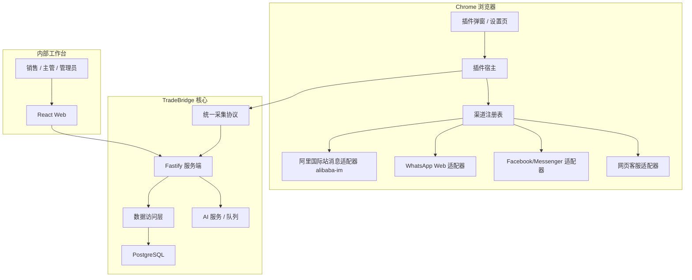
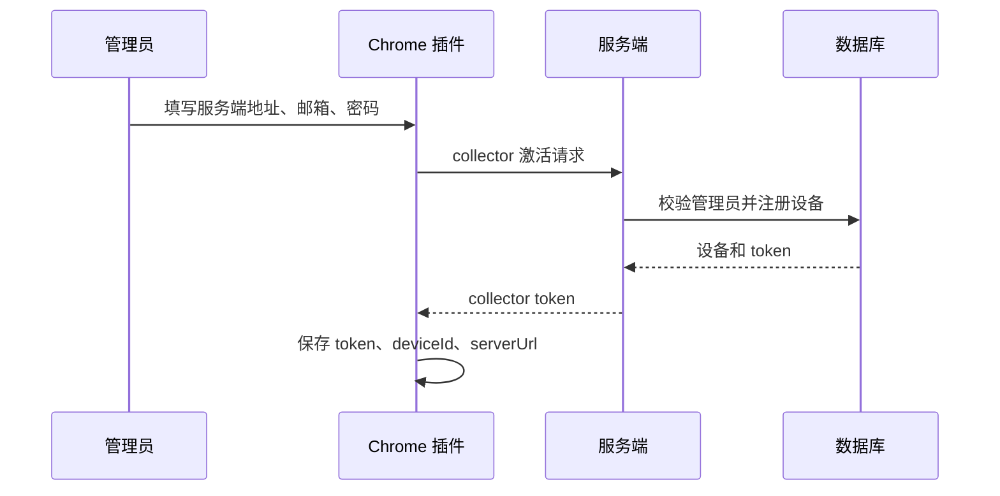
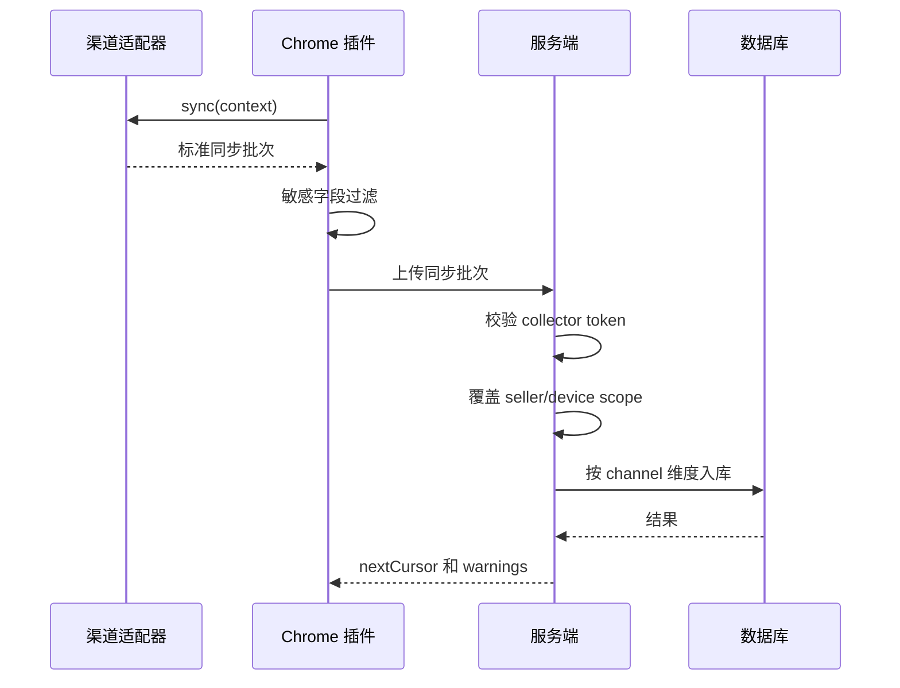
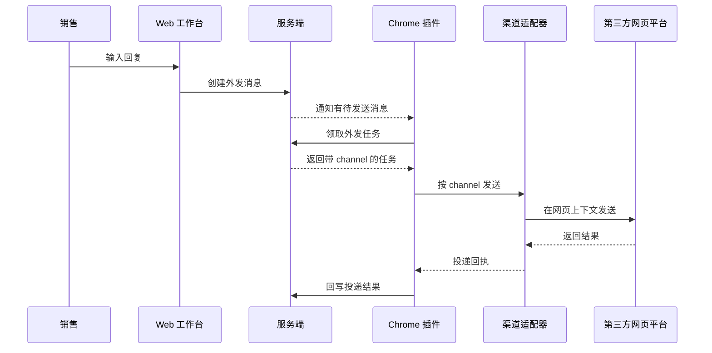

# TradeBridge 产品设计文档

日期：2026-06-02
状态：产品设计稿
范围：Chrome 浏览器插件、多渠道网页消息桥、内部销售工作台、服务端协议与数据平台。

## 1. 产品定义

TradeBridge 是一个面向跨境销售、客服和运营团队的浏览器插件消息桥。它通过 Chrome 插件连接第三方网页沟通平台，把分散在不同网页渠道里的客户、会话和消息同步到内部系统，再由销售团队在统一工作台里查看客户上下文、协作跟进、创建回复，并由插件把回复投递回原始网页渠道。

TradeBridge 不是桌面采集器，也不是单一 OneTalk 工具。它的长期目标是建立一套可扩展的网页消息通道架构：

- 插件负责贴近浏览器页面。
- 渠道适配器负责理解不同平台。
- 协议层负责统一同步、外发和状态。
- 数据层负责沉淀统一客户、会话、消息和外发任务。
- Web 工作台负责销售团队的协作和使用体验。

当前第一条真实业务链路来自阿里国际站消息体系。这里必须严谨区分“渠道”和“实现面”。

## 2. 渠道定义：TM、TradeManager、OneTalk、旺旺的关系

### 2.1 结论

在本项目中，TM、TradeManager、国际版旺旺、旺旺、OneTalk 不应被直接拆成多个平级渠道。

更准确的产品定义是：

```text
渠道：阿里国际站消息通道
渠道 ID：alibaba-im
业务别名：TM / TradeManager / 国际版旺旺 / 旺旺
当前优先实现面：OneTalk Web
当前接入页面：onetalk.alibaba.com
历史或备用网页入口：message.alibaba.com
非当前目标：TM 桌面客户端、本机 AliSupplier、AliWorkbench、本机缓存或 Cookie 读取
```

也就是说，TM 更像阿里国际站即时沟通产品或历史客户端名称；TradeManager 是官方常见英文名；旺旺或国际版旺旺是业务口径；OneTalk 是当前项目正在接入的 Web 端消息中心和页面运行时。

因此，产品文档和代码设计中应使用：

- `alibaba-im` 表示阿里国际站消息通道。
- `onetalk-web` 表示当前具体实现面。

不应使用：

- `tm` 和 `onetalk` 作为两个并列渠道。
- 把 TM 与 OneTalk 写成两个同级渠道适配器。

### 2.2 为什么要这样定义

如果把 TM 和 OneTalk 写成两个渠道，会带来三个问题：

1. 业务语义重复
   - 对用户来说，它们都指向阿里国际站买卖双方即时沟通。
   - 拆成两个渠道会让产品和数据口径混乱。

2. 数据模型错误
   - 同一个客户、会话、消息可能在 TM/TradeManager/OneTalk 口径下被重复入库。
   - 外发路由也会出现目标渠道不明确的问题。

3. 架构扩展失真
   - 真正应该抽象的是“阿里国际站消息通道”和“其他外部渠道”的差异。
   - OneTalk 只是 `alibaba-im` 的一个网页实现面，不应被提升成与 TM 并列的业务渠道。

### 2.3 后续命名规则

后续设计和代码中建议使用：

| 类型 | 推荐命名 | 说明 |
| --- | --- | --- |
| 渠道 ID | `alibaba-im` | 阿里国际站消息通道 |
| 实现面 | `onetalk-web` | OneTalk 网页端 |
| 业务别名 | TM、TradeManager、国际版旺旺、旺旺 | 只用于展示、说明或兼容历史叫法 |
| 适配器目录 | `channels/alibaba-im` | 不使用 `channels/tm` 和 `channels/onetalk` 并列 |
| 错误码前缀 | `alibaba_im_*` | 对外协议错误码 |
| 内部诊断 | `onetalk_*` | 仅表示 OneTalk Web 实现面的内部错误 |

## 3. 产品背景

跨境销售团队经常同时面对多个沟通入口：

- 阿里国际站消息通道：TM、TradeManager、国际版旺旺、OneTalk Web。
- WhatsApp Web。
- Facebook Page 或 Messenger。
- 独立站网页客服。
- 其他未来可能接入的网页沟通系统。

这些沟通入口分散在不同网页、不同账号和不同页面结构中。团队会遇到几个问题：

- 客户上下文割裂：同一个客户在多个地方沟通过，销售无法快速看到完整历史。
- 协作能力弱：备注、标签、任务、负责人不容易沉淀。
- 外发不可控：销售直接在各个平台回复，内部缺少队列、审计和回执。
- 数据不统一：消息、客户、会话字段每个平台都不同，难以形成统一客户资产。
- 扩展成本高：如果每个平台都单独做工具，后续维护成本会越来越高。

TradeBridge 要解决的是“多网页沟通入口统一桥接”的问题，而不是只做某一个平台的聊天记录导出。

## 4. 产品目标

### 4.1 统一客户消息入口

把不同网页渠道中的客户、会话和消息同步到 TradeBridge，销售在一个工作台查看客户沟通历史。

### 4.2 统一消息外发闭环

销售在 Web 工作台创建回复，服务端进入外发队列，Chrome 插件按渠道领取并投递，投递结果回写服务端。

### 4.3 统一团队协作

围绕客户沉淀备注、标签、负责人、跟进任务、客户阶段和操作审计。

### 4.4 支持渠道扩展

新增一个渠道时，只新增或修改对应渠道适配器，不应大幅修改插件宿主、服务端协议和数据库主流程。

### 4.5 保护第三方凭据

系统不保存第三方平台账号密码、Cookie、CSRF token、IM token、页面运行时密钥。插件只在用户已经登录的网页上下文中调用必要能力。

## 5. 非目标

当前产品不做：

- 桌面端采集器。
- Electron 采集端。
- 本机应用监听。
- 本机 AliSupplier、AliWorkbench、TradeManager 客户端缓存读取。
- 本机 Cookie 数据库读取。
- 服务端代持第三方平台登录凭据。
- 服务端直接模拟第三方平台发送消息。
- 绕过第三方平台登录、验证码、风控或权限控制。
- 一期一次性接入所有渠道。

历史代码中的 `apps/collector-desktop` 不符合未来产品定位，后续应移除。

## 6. 目标用户

### 6.1 销售人员

销售人员需要：

- 快速查看客户历史沟通。
- 了解客户当前诉求和跟进状态。
- 在统一工作台回复客户。
- 查看消息是否已经发送成功。

### 6.2 销售主管

销售主管需要：

- 分配客户。
- 查看团队跟进情况。
- 检查重要客户是否及时回复。
- 查看客户标签、任务和沟通质量。

### 6.3 管理员

管理员需要：

- 初始化系统。
- 管理内部用户。
- 激活和撤销插件设备。
- 查看渠道连接状态和审计记录。

### 6.4 运营或管理层

运营或管理层需要：

- 查看客户来源。
- 查看团队响应效率。
- 查看消息量和客户活跃度。
- 评估销售流程和客户转化。

## 7. 核心场景

### 7.1 销售查看客户完整沟通历史

客户先通过阿里国际站消息通道咨询，后续又在 WhatsApp Web 继续沟通。插件分别同步两个网页渠道的数据。TradeBridge 将这些会话放在同一客户视角下，销售可以按渠道查看，也可以查看统一时间线。

### 7.2 销售从内部工作台回复客户

销售选择一个具体渠道会话，输入回复。服务端创建外发任务，任务中包含目标渠道、渠道账号、客户身份和会话 ID。Chrome 插件领取任务后，根据渠道找到对应适配器，在目标网页页面中发送消息，并把结果回写服务端。

### 7.3 主管分配和跟进客户

主管在 Web 工作台看到新客户后分配负责人，添加标签和任务。后续该客户在不同渠道产生的消息都进入同一客户上下文。

### 7.4 管理员激活插件

管理员在插件设置页填写 TradeBridge 服务地址和管理员账号。服务端注册 collector device 并返回 collector token。插件保存 collector token，不保存管理员密码。后续同步和外发都使用 collector token。

### 7.5 渠道不可用时安全降级

如果 WhatsApp Web 页面没有打开，或阿里国际站消息页面登录失效，插件上报对应渠道不可用。服务端保留外发任务，不把消息误标为已发送。Web 工作台提示该渠道暂不可发送。

## 8. 产品功能

### 8.1 Chrome 插件

Chrome 插件是 TradeBridge 的渠道连接宿主。

主要功能：

- 插件激活。
- 服务端连接校验。
- collector token 保存。
- 渠道页面检测。
- 渠道登录状态检测。
- 数据同步。
- 敏感字段过滤。
- 外发任务领取。
- 消息投递。
- 投递结果回写。
- WebSocket 实时连接。
- popup 状态展示。
- options 配置管理。

### 8.2 渠道适配器

每个渠道适配器负责一个渠道族或一个明确的网页沟通平台。

首批渠道规划：

| 渠道 | 渠道 ID | 当前状态 | 说明 |
| --- | --- | --- | --- |
| 阿里国际站消息通道 | `alibaba-im` | 第一优先级 | 包含 TM、TradeManager、国际版旺旺、OneTalk Web 的业务域 |
| WhatsApp Web | `whatsapp-web` | 后续接入 | 需要独立页面检测、消息读取和发送能力 |
| Facebook/Messenger | `facebook-messenger` | 后续接入 | 可能涉及 Page、Messenger 和权限差异 |
| 独立站网页客服 | `web-chat` | 后续接入 | 适合抽象成可配置网页客服适配器 |
| 架构验证渠道 | `mock-web` | 开发验证 | 用于证明多渠道架构，不连接真实平台 |

阿里国际站消息适配器内部可以继续区分：

- `onetalk-web`：当前优先实现面。
- `message-alibaba-legacy`：旧版消息入口，仅作为后续兼容评估。

### 8.3 服务端

服务端是安全边界和业务入口。

主要功能：

- 内部用户登录。
- 管理员初始化。
- 用户管理。
- collector device 激活和撤销。
- collector token 鉴权。
- channel-aware sync batch 接收。
- 消息去重。
- outbound queue。
- delivery report。
- WebSocket collector hub。
- 客户、会话、消息查询。
- 备注、标签、任务、分配。
- 审计日志。
- AI 摘要和回复建议。

### 8.4 Web 工作台

Web 工作台是销售团队的主界面。

主要功能：

- 客户列表。
- 客户详情。
- 渠道会话列表。
- 消息流。
- 回复输入。
- 外发状态展示。
- 备注。
- 标签。
- 跟进任务。
- 客户分配。
- 用户管理。
- 渠道连接状态。
- AI 摘要和回复建议。

展示原则：

- 客户是统一视角。
- 会话保留渠道来源。
- 消息保留渠道来源。
- 回复必须选择具体渠道会话。
- 渠道不可用时不能假装可发送。

## 9. 产品架构



## 10. 架构分层

### 10.1 插件宿主层

职责：

- 插件生命周期。
- 状态存储。
- 同步调度。
- WebSocket 连接。
- HTTP fallback。
- 渠道注册表。
- popup/options 通信。

不负责：

- OneTalk LWP 细节。
- WhatsApp DOM 细节。
- Facebook 权限细节。
- 第三方平台字段解析。

### 10.2 渠道适配层

职责：

- 判断页面是否属于该渠道。
- 判断登录状态。
- 调用页面 SDK 或网页接口。
- 解析渠道原始数据。
- 生成统一同步批次。
- 投递外发消息。
- 生成渠道诊断信息。

### 10.3 协议层

职责：

- 定义插件和服务端的统一数据结构。
- 定义 WebSocket 消息。
- 定义 outbound task 和 delivery report。
- 定义 channel status。
- 提供解析和校验函数。

协议层不依赖具体渠道。

### 10.4 数据层

职责：

- 存储 seller。
- 存储 channel account。
- 存储统一 contact。
- 存储 channel identity。
- 存储 conversation。
- 存储 message。
- 存储 outbound message。
- 存储 audit log。

数据层必须用渠道维度避免外部 ID 冲突。

### 10.5 应用层

职责：

- 内部工作台。
- 用户权限。
- 客户协作。
- 外发创建。
- AI 辅助。
- 运营看板。

## 11. 核心流程

### 11.1 插件激活



### 11.2 入站同步



### 11.3 外发投递



## 12. 数据模型原则

核心对象：

- `seller_account`：业务隔离维度。
- `channel_account`：某 seller 下的某渠道账号。
- `contact`：内部统一客户。
- `channel_identity`：客户在某渠道上的身份。
- `conversation`：渠道会话。
- `message`：渠道消息。
- `outbound_message`：待发送消息。
- `audit_log`：审计日志。

唯一键原则：

```text
seller + channel + channelAccount + externalId
```

不要只按：

```text
seller + externalId
```

原因：

- 不同渠道的外部 ID 可能相同。
- 同一客户在多个渠道可能有不同身份。
- 同一渠道不同账号下的会话也可能有 ID 冲突。

## 13. 安全要求

### 13.1 Token 边界

- internal session token 只用于 Web 工作台。
- collector token 只用于 Chrome 插件。
- 两类 token 不能混用。
- 服务端只保存 token hash。

### 13.2 第三方凭据保护

不得上传或保存：

- 第三方账号密码。
- Cookie。
- Authorization header。
- CSRF token。
- IM access token。
- refresh token。
- 页面运行时敏感对象。
- `ctoken`、`_tb_token_`、`cookie2`、`sgcookie`、`chatToken` 等敏感字段。

### 13.3 脱敏策略

- 插件上传前递归过滤。
- 服务端接收前二次扫描。
- 测试覆盖敏感字段。
- 日志只记录错误码和脱敏诊断。

## 14. 产品指标

业务指标：

- 同步客户数。
- 同步会话数。
- 同步消息数。
- 外发成功率。
- 平均回复耗时。
- 跟进任务完成率。
- 多渠道客户合并率。

技术指标：

- 每渠道连接可用率。
- 同步成功率。
- WebSocket 在线时长。
- 外发领取到回执耗时。
- rejected message 数量。
- 敏感字段拦截次数。
- 渠道适配器错误码分布。

体验指标：

- 客户详情加载耗时。
- 消息列表加载耗时。
- 回复排队到发送成功耗时。
- 渠道不可用提示准确率。

## 15. 版本规划

### V0.1 阿里国际站消息 MVP

- Chrome 插件接入 `alibaba-im`。
- 当前实现面为 OneTalk Web。
- 同步客户、会话和消息。
- Web 工作台查看客户和消息。
- Web 创建外发消息。
- 插件投递回 OneTalk Web。

### V0.2 多渠道架构重构

- 移除桌面采集端。
- 协议增加 channel 维度。
- 数据库增加 channel account。
- 引入渠道注册表。
- `alibaba-im` 成为第一个正式渠道适配器。
- 增加 `mock-web` 验证多渠道架构。

### V0.3 第二真实渠道

- 按业务优先级接入 WhatsApp Web、Facebook/Messenger 或独立站网页客服中的一个。
- 验证跨渠道客户、会话和外发路由。
- Web 支持渠道筛选和渠道状态展示。

### V0.4 统一客户增强

- 支持多个渠道身份合并到统一客户。
- 支持人工合并和拆分。
- 支持客户阶段、负责人、标签、任务。
- 支持未回复提醒和渠道级跟进规则。

### V0.5 智能辅助

- 客户摘要。
- 回复建议。
- 意向等级识别。
- 下一步动作建议。
- 团队运营看板。

## 16. 风险与应对

### 16.1 第三方页面变化

风险：网页结构、SDK、接口字段变化。

应对：

- 每个适配器保留 diagnostics。
- 每个适配器单独测试。
- 原始数据只存脱敏片段。
- 错误码标准化。

### 16.2 阿里国际站口径混乱

风险：TM、TradeManager、旺旺、OneTalk 等名称混用导致产品和数据建模混乱。

应对：

- 产品层统一为 `alibaba-im`。
- OneTalk 只作为 `onetalk-web` 实现面。
- 文档明确业务别名。
- 数据库和协议不使用 `tm` 与 `onetalk` 两个平级渠道。

### 16.3 多渠道客户识别困难

风险：同一个客户在多个渠道身份不同，难以自动合并。

应对：

- 先以 channel identity 分开沉淀。
- 支持人工合并。
- 后续用邮箱、手机号、公司名、域名等辅助匹配。

### 16.4 外发失败或重复

风险：插件重启、页面未打开、多设备同时在线会影响外发。

应对：

- outbound claim/lease。
- delivery report 幂等。
- 临时失败不立即标记永久失败。
- 记录 claimedBy、claimExpiresAt、deliveredAt。

### 16.5 敏感数据泄露

风险：第三方响应中混入 token 或 Cookie。

应对：

- 插件端过滤。
- 服务端二次扫描。
- 测试覆盖。
- 日志脱敏。

## 17. 成功标准

产品达到目标时，应满足：

- TradeBridge 明确定位为 Chrome 插件多渠道网页消息桥。
- TM、TradeManager、旺旺、OneTalk 被正确归入阿里国际站消息通道。
- OneTalk 是 `alibaba-im` 的当前 Web 实现面，不是与 TM 并列的独立渠道。
- 桌面采集端不再作为产品方向。
- 新渠道接入只需要新增渠道适配器和少量配置。
- 协议层不依赖具体渠道。
- 数据库能区分渠道、渠道账号、外部身份和外部会话。
- Web 工作台能查看多渠道客户沟通。
- 外发消息能按 channel 正确路由并回写结果。
- 系统不保存第三方登录凭据。

## 18. 资料依据

- 阿里巴巴官方 TradeManager 页面说明 TradeManager 是 Alibaba.com 上的即时沟通工具。
- 阿里卖家 App 公开说明中提到其融合并扩展了 TradeManager（即国际版阿里旺旺）核心功能。
- 项目本地调研文档确认当前代码接入的是 `onetalk.alibaba.com`、LWP WebSocket、MTop token、OneTalk 页面 SDK 和消息路由。
- 当前代码中的 `packages/onetalk-adapter`、`apps/chrome-extension/src/content/onetalk-*` 和 `apps/chrome-extension/src/background/onetalk-*` 说明现有实现面是 OneTalk Web。

## 19. 相关文档

- [Chrome 插件多渠道消息桥重构实施方案](superpowers/plans/2026-06-02-Chrome插件多渠道消息桥重构实施方案.md)
- [TradeBridge 当前系统设计方案](superpowers/specs/2026-06-01-tradebridge-current-system-design.md)
- [OneTalk Network HAR Analysis](superpowers/specs/2026-05-27-onetalk-network-har-analysis.md)
- [Chrome 插件内部试运行手册](chrome-extension-trial-runbook.md)
