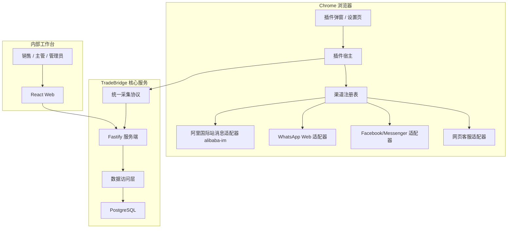

# Chrome 插件多渠道消息桥重构实施方案

> **给后续执行者：** 本文是后续开发的执行计划。请按任务顺序推进，每个任务完成后运行对应验证命令。不要跳过“TM 与 OneTalk 关系校准”和“移除桌面采集端”两个前置任务。

**目标：** 把 TradeBridge 从当前偏 OneTalk 的试运行系统，重构为以 Chrome 浏览器插件为核心的多渠道网页消息桥，支持阿里国际站消息通道、WhatsApp Web、Facebook/Messenger、独立站网页客服等后续渠道。

**核心架构：** Chrome 插件作为唯一采集和投递宿主；各第三方平台通过独立渠道适配器接入；插件与服务端之间使用统一协议；数据库沉淀统一业务数据；Web 工作台只面对标准化客户、会话、消息和外发任务。

**关键边界：** 未来产品不做桌面监听，不做 Electron 桌面采集器，不读取本机应用日志、缓存、Cookie 数据库或安全存储。历史 `apps/collector-desktop` 需要移除。

---

## 1. 重要纠偏：TM 与 OneTalk 的关系

本项目不能把 “TM” 和 “OneTalk” 轻率写成两个独立渠道。

在阿里国际站语境里，TM 通常指 TradeManager，也就是阿里国际站的即时沟通工具，常被称为国际版阿里旺旺或国际站旺旺。当前项目代码和调研文档实际接入的是 `https://onetalk.alibaba.com/` 及其 LWP/WebSocket、页面 SDK、MTop token、客户资料等能力。也就是说：

- **TM/TradeManager** 更偏业务产品名或历史客户端名称。
- **OneTalk** 更偏当前 Web 端消息中心、页面运行时和接口承载面。
- **旺旺/国际版旺旺** 是业务人员常用叫法。
- 对 TradeBridge 来说，它们应先归为同一个渠道族：**阿里国际站消息通道**。

因此，后续设计中不再把 `tm` 与 `onetalk` 并列成两个渠道。正确表达应是：

```text
渠道：阿里国际站消息通道
渠道 ID：alibaba-im
当前优先实现面：OneTalk Web（onetalk.alibaba.com）
历史或别名：TM / TradeManager / 国际版旺旺 / 旺旺
非当前目标面：TM 桌面客户端、AliSupplier 桌面端、本机缓存和本机登录态读取
```

如果未来发现阿里国际站存在另一个与 OneTalk Web 数据源、会话体系、账号体系明显不同的 Web 消息入口，也应先作为 `alibaba-im` 下的子实现面评估，而不是直接新增一个独立渠道。

## 2. 产品定位边界

TradeBridge 是浏览器插件项目，不是桌面采集项目。

后续所有采集和外发能力都应围绕 Chrome 插件展开：

- 用户在 Chrome 中登录第三方网页平台。
- 插件检测可用页面和登录状态。
- 插件通过渠道适配器读取网页端数据。
- 插件上传脱敏后的标准化数据。
- 插件领取服务端外发任务，并回到对应网页上下文中发送。

明确不做：

- 不做桌面端采集器。
- 不监听桌面应用。
- 不读取本机 AliWorkbench、AliSupplier、TradeManager 客户端缓存。
- 不读取本机 Cookie DB。
- 不使用 Electron 作为后续采集主路径。
- 不把第三方平台账号密码、Cookie、CSRF token、IM token 保存到服务端。

## 3. 当前问题

当前代码已经跑通 OneTalk MVP，但架构中心仍偏 OneTalk：

- `apps/chrome-extension/src/shared/sync-types.ts` 从 `@wangwang/onetalk-adapter/browser` 导出同步类型，协议层被 OneTalk 适配层反向污染。
- `apps/chrome-extension/src/background/index.ts` 直接创建 `BrowserOnetalkLwpClient`，插件宿主知道 OneTalk 私有实现。
- `apps/chrome-extension/src/background/outbound-orchestrator.ts` 直接调用 OneTalk tab messaging，外发路由不可扩展。
- `packages/collector-protocol/src/index.ts` 存在 `connectedToOneTalk` 这种渠道专名字段。
- 数据库缺少 `channel` 和 `channel_account` 维度。
- `apps/collector-desktop` 与未来浏览器插件定位冲突。
- 文档中仍有桌面采集、Electron、AliWorkbench 本机登录态等历史方向。

## 4. 目标分层



### 4.1 插件宿主层

职责：

- 插件安装、启动和 alarm。
- 插件配置、设备激活和 token 保存。
- WebSocket 连接和 HTTP fallback。
- 同步调度。
- 外发任务领取。
- 渠道状态汇总。
- popup/options UI 消息。

插件宿主不能直接写 OneTalk、WhatsApp、Facebook 的私有逻辑。

### 4.2 渠道适配层

每个渠道适配器负责自己的网页检测、页面桥、协议调用、字段映射和发送逻辑。

统一接口建议：

```ts
export interface ChannelAdapter {
  channel: ChannelId;
  displayName: string;
  matchUrl(url: string): boolean;
  detect(context: ChannelRuntimeContext): Promise<ChannelConnectionStatus>;
  sync(context: ChannelSyncContext): Promise<ChannelSyncBatch>;
  send(context: ChannelSendContext, task: OutboundDeliveryTask): Promise<OutboundDeliveryReport>;
}
```

首个真实适配器：

```text
channel: "alibaba-im"
displayName: "阿里国际站消息"
surface: "OneTalk Web"
aliases: ["OneTalk", "TM", "TradeManager", "国际版旺旺", "旺旺"]
```

### 4.3 协议层

`packages/collector-protocol` 负责插件与服务端之间的统一协议：

- `ChannelId`
- `ChannelAccountRef`
- `ChannelSyncBatch`
- `ChannelSyncContact`
- `ChannelSyncConversation`
- `ChannelSyncMessage`
- `OutboundDeliveryTask`
- `OutboundDeliveryReport`
- `ChannelConnectionStatus`
- WebSocket envelope、parser 和 type guard。

协议层不能依赖 `onetalk-adapter`。

### 4.4 数据层

`packages/database` 负责统一业务数据：

- `seller_account`
- `channel_account`
- `contact`
- `channel_identity`
- `conversation`
- `message`
- `outbound_message`
- `audit_log`

唯一键必须包含渠道维度：

```text
seller + channel + channelAccount + externalId
```

不能只使用：

```text
seller + externalCustomerId
```

### 4.5 应用层

`apps/server` 和 `apps/web` 面向统一业务模型：

- 服务端校验 token、覆盖 scope、入库、出队、回执、审计。
- Web 工作台展示统一客户、渠道会话、消息流、备注、标签、任务和外发状态。

## 5. 文件调整总览

### 5.1 删除

- `apps/collector-desktop`

### 5.2 修改

- `package.json`
  - 删除 `@wangwang/collector-desktop` 的 build/typecheck/test:e2e 引用。
- `README.md`
  - 改成 Chrome 插件多渠道消息桥定位。
  - 删除桌面采集端说明。
- `docs/ENVIRONMENT.md`
  - 删除 Electron 和桌面采集端环境变量说明。
- `docs/internal-trial-runbook.md`
  - 删除桌面试运行路径。
- `docs/chrome-extension-trial-runbook.md`
  - 改成“Chrome 插件 + 阿里国际站消息通道首个适配器”的试运行说明。
- `apps/chrome-extension/public/manifest.json`
  - 插件名称改成中文或中性产品名。
  - OneTalk 权限保留为阿里国际站消息适配器所需权限。
  - 后续渠道使用 optional host permissions。
- `apps/chrome-extension/src/shared/sync-types.ts`
  - 不再从 `@wangwang/onetalk-adapter/browser` 导出同步类型。
- `packages/collector-protocol/src/index.ts`
  - 增加渠道感知协议。
  - 移除 `connectedToOneTalk`。
- `packages/database/src/sync-types.ts`
  - 增加 channel、channelAccountExternalId 等字段。
- `packages/database/src/sync-store.ts`
  - 增加内存版渠道维度。
- `packages/database/src/postgres-sync-store.ts`
  - 增加 Postgres 版渠道维度。
- `apps/server/src/server.ts`
  - 接收和校验 channel-aware sync batch。
- `apps/server/src/collector-ws.ts`
  - 外发任务按 channel 路由。
- `apps/chrome-extension/src/background/index.ts`
  - 改成插件宿主，只调用渠道注册表。
- `apps/chrome-extension/src/background/sync-orchestrator.ts`
  - 改为调用 `ChannelAdapter.sync()`。
- `apps/chrome-extension/src/background/outbound-orchestrator.ts`
  - 改为根据 outbound task 的 channel 找 adapter。
- `apps/web/src/types.ts`
  - 增加渠道字段。
- `apps/web/src/dashboard-state.ts`
  - 支持按渠道展示会话。

### 5.3 新增

- `apps/chrome-extension/src/channels/channel-adapter.ts`
- `apps/chrome-extension/src/channels/channel-registry.ts`
- `apps/chrome-extension/src/channels/alibaba-im/alibaba-im-adapter.ts`
- `apps/chrome-extension/src/channels/alibaba-im/onetalk-page-bridge.ts`
- `apps/chrome-extension/src/channels/alibaba-im/onetalk-page-script.ts`
- `apps/chrome-extension/src/channels/mock-web/mock-web-adapter.ts`
- `packages/database/migrations/005_channel_dimension.sql`
- `docs/Chrome插件多渠道消息桥产品架构.md`

## 6. 任务一：校准渠道命名和文档

**目标：** 消除 `TM` 与 `OneTalk` 被错误拆成两个渠道的问题。

**文件：**

- 修改：`README.md`
- 修改：`docs/tradebridge-product-design-prd.md` 或重命名后的中文 PRD
- 修改：本实施方案引用处
- 修改：后续新增架构文档

**步骤：**

- [ ] 全局搜索 `TM`、`TradeManager`、`OneTalk`、`旺旺`。
- [ ] 将产品渠道表述统一为“阿里国际站消息通道”。
- [ ] 明确别名和实现面：
  - 业务别名：TM、TradeManager、国际版旺旺、旺旺。
  - 当前 Web 实现面：OneTalk Web。
  - 当前接入 URL：`onetalk.alibaba.com`。
- [ ] 不再把 `tm` 和 `onetalk` 放入同级渠道枚举。
- [ ] 将计划中旧的 OneTalk 与 TM 并列枚举改为 `"alibaba-im"`。

**验证：**

```bash
rg -n "并列.*TM.*OneTalk|并列.*OneTalk.*TM|独立渠道.*TM|独立渠道.*OneTalk" docs apps packages
```

预期：

- 不再出现把 TM 与 OneTalk 并列为独立渠道的描述。
- OneTalk 只作为 `alibaba-im` 的当前 Web 实现面出现。

## 7. 任务二：移除桌面采集端

**目标：** 让仓库定位与产品定位一致，只保留 Chrome 插件采集和投递路径。

**文件：**

- 删除：`apps/collector-desktop`
- 修改：`package.json`
- 修改：`README.md`
- 修改：`docs/ENVIRONMENT.md`
- 修改：`docs/internal-trial-runbook.md`
- 修改：`docs/chrome-extension-trial-runbook.md`

**步骤：**

- [ ] 新增项目结构测试，确认 root scripts 不引用 `@wangwang/collector-desktop`。
- [ ] 删除 `apps/collector-desktop`。
- [ ] 从 `package.json` 的 `build`、`typecheck`、`test:e2e` 中删除桌面采集端。
- [ ] 从文档中删除 Electron、桌面采集、本机 Cookie DB、本机缓存读取等说明。
- [ ] 保留历史设计文档时，标注其为历史方向，不作为未来产品路线。

**建议测试：**

```ts
import assert from "node:assert/strict";
import fs from "node:fs";
import path from "node:path";
import { fileURLToPath } from "node:url";
import { test } from "node:test";

const root = path.resolve(path.dirname(fileURLToPath(import.meta.url)), "../..");

test("项目只保留 Chrome 插件采集宿主", () => {
  const rootPackage = JSON.parse(fs.readFileSync(path.join(root, "package.json"), "utf8"));
  const scripts = JSON.stringify(rootPackage.scripts);

  assert.equal(scripts.includes("@wangwang/collector-desktop"), false);
  assert.equal(fs.existsSync(path.join(root, "apps/collector-desktop")), false);
});
```

**验证：**

```bash
npm run build
npm run typecheck
node --import tsx --test test/e2e/project-structure.test.ts
```

## 8. 任务三：把统一同步类型移到协议层

**目标：** 协议层不再依赖 OneTalk adapter。

**文件：**

- 修改：`packages/collector-protocol/src/index.ts`
- 修改：`packages/collector-protocol/test/collector-protocol.test.ts`
- 修改：`apps/chrome-extension/src/shared/sync-types.ts`
- 修改：`packages/onetalk-adapter/src/sync-mapper.ts`
- 修改：`packages/database/src/sync-types.ts`

**步骤：**

- [ ] 在 `collector-protocol` 中新增：
  - `ChannelId`
  - `ChannelAccountRef`
  - `ChannelSyncBatch`
  - `ChannelSyncContact`
  - `ChannelSyncConversation`
  - `ChannelSyncMessage`
  - `OutboundDeliveryTask`
  - `OutboundDeliveryReport`
  - `ChannelConnectionStatus`
- [ ] `ChannelId` 第一阶段使用：

```ts
export type BuiltInChannelId = "alibaba-im" | "whatsapp-web" | "facebook-messenger" | "web-chat" | "mock-web";
export type ChannelId = BuiltInChannelId | (string & {});
```

- [ ] `apps/chrome-extension/src/shared/sync-types.ts` 改为从 `@wangwang/collector-protocol` 导出同步类型。
- [ ] OneTalk mapper 输出 `channel: "alibaba-im"`。
- [ ] `sourceMeta` 中增加 `surface: "onetalk-web"`。

**验证：**

```bash
npm run test -w @wangwang/collector-protocol
npm run test -w @wangwang/onetalk-adapter
npm run test -w @wangwang/chrome-extension
npm run typecheck
```

## 9. 任务四：数据库增加渠道维度

**目标：** 支持同一 seller 下多个渠道账号、多个渠道身份、多个渠道会话。

**文件：**

- 新增：`packages/database/migrations/005_channel_dimension.sql`
- 修改：`packages/database/src/migrations.ts`
- 修改：`packages/database/src/sync-types.ts`
- 修改：`packages/database/src/sync-store.ts`
- 修改：`packages/database/src/postgres-sync-store.ts`
- 修改：`packages/database/test/migrations.test.ts`
- 修改：`packages/database/test/sync-store.test.ts`
- 修改：`packages/database/test/postgres-sync-store.test.ts`

**步骤：**

- [ ] 新增 `channel_account` 表。
- [ ] 给 `sync_batch` 增加 `channel`、`channel_account_id`。
- [ ] 给 `customer` 或后续 `contact/channel_identity` 增加渠道维度。
- [ ] 给 `conversation` 增加 `channel`、`channel_account_id`。
- [ ] 给 `message` 增加 `channel`。
- [ ] 给 `outbound_message` 增加 `channel`、`channel_account_id`。
- [ ] 所有唯一键和查询补充 channel 维度。

**迁移草案：**

```sql
CREATE TABLE IF NOT EXISTS channel_account (
  id UUID PRIMARY KEY DEFAULT gen_random_uuid(),
  seller_account_id UUID NOT NULL REFERENCES seller_account(id) ON DELETE CASCADE,
  channel TEXT NOT NULL,
  external_account_id TEXT NOT NULL,
  display_name TEXT,
  status TEXT NOT NULL DEFAULT 'active',
  last_seen_at TIMESTAMPTZ,
  created_at TIMESTAMPTZ NOT NULL DEFAULT now(),
  updated_at TIMESTAMPTZ NOT NULL DEFAULT now(),
  UNIQUE (seller_account_id, channel, external_account_id)
);
```

**验证：**

```bash
npm run test -w @wangwang/database
npm run test -w @wangwang/server
npm run typecheck
```

## 10. 任务五：引入 Chrome 插件渠道注册表

**目标：** 插件 background 不再直接知道 OneTalk 私有实现。

**文件：**

- 新增：`apps/chrome-extension/src/channels/channel-adapter.ts`
- 新增：`apps/chrome-extension/src/channels/channel-registry.ts`
- 新增：`apps/chrome-extension/src/channels/alibaba-im/alibaba-im-adapter.ts`
- 修改：`apps/chrome-extension/src/background/index.ts`
- 修改：`apps/chrome-extension/src/background/sync-orchestrator.ts`
- 修改：`apps/chrome-extension/src/background/outbound-orchestrator.ts`

**步骤：**

- [ ] 定义 `ChannelAdapter` 接口。
- [ ] 定义 `ChannelRegistry`。
- [ ] 把现有 OneTalk LWP、page bridge、token、conversation、customer profile、send 逻辑包进 `alibaba-im` adapter。
- [ ] background 只创建 registry 并调用通用 orchestrator。
- [ ] outbound 通过 `registry.get(task.channel).send(...)` 路由。
- [ ] sync 通过 enabled adapters 循环执行。

**验证：**

```bash
npm run test -w @wangwang/chrome-extension
npm run typecheck -w @wangwang/chrome-extension
```

额外检查：

```bash
rg -n "BrowserOnetalkLwpClient|requestOneTalk|sendOutboundMessagesViaOneTalk" apps/chrome-extension/src/background/index.ts
```

预期：无结果。

## 11. 任务六：WebSocket 协议渠道化

**目标：** 实时连接不再出现 OneTalk 专名，外发领取按渠道能力过滤。

**文件：**

- 修改：`packages/collector-protocol/src/index.ts`
- 修改：`apps/server/src/collector-ws.ts`
- 修改：`apps/server/src/collector-realtime-hub.ts`
- 修改：`apps/chrome-extension/src/background/tradebridge-ws-client.ts`
- 修改：`apps/chrome-extension/src/background/realtime-orchestrator.ts`

**步骤：**

- [ ] `collector.hello` 的 capabilities 改成渠道能力列表：

```ts
capabilities: Array<{
  channel: ChannelId;
  canSync: boolean;
  canSend: boolean;
}>;
```

- [ ] `collector.status` 改成：

```ts
channels: Array<{
  channel: ChannelId;
  connected: boolean;
  surface?: string;
  pageUrl?: string;
  lastSyncedAt?: string;
  lastErrorCode?: string;
}>;
```

- [ ] `outbound.available`、`outbound.claim`、`outbound.claimed` 带 channel。
- [ ] server claim 时只返回该 collector 声明可发送的渠道任务。
- [ ] extension 收到 task 后按 channel 找 adapter。

**验证：**

```bash
npm run test -w @wangwang/collector-protocol
npm run test -w @wangwang/server
npm run test -w @wangwang/chrome-extension
```

## 12. 任务七：整理阿里国际站消息适配器

**目标：** 把 OneTalk 现有实现整理为 `alibaba-im` 渠道下的 OneTalk Web 实现面。

**文件：**

- 新增或移动：`apps/chrome-extension/src/channels/alibaba-im/alibaba-im-adapter.ts`
- 新增或移动：`apps/chrome-extension/src/channels/alibaba-im/onetalk-page-bridge.ts`
- 新增或移动：`apps/chrome-extension/src/channels/alibaba-im/onetalk-page-script.ts`
- 修改：`apps/chrome-extension/public/manifest.json`
- 修改：`apps/chrome-extension/test/manifest.test.ts`
- 修改：`apps/chrome-extension/test/onetalk-page-script.test.ts`

**步骤：**

- [ ] manifest 插件名称改为中性名称，例如 `TradeBridge 消息桥`。
- [ ] content script 路径按渠道组织。
- [ ] 保留 `onetalk.alibaba.com` 权限作为阿里国际站消息通道第一实现面。
- [ ] 内部错误码可以继续用 `onetalk_*` 表示具体实现面错误。
- [ ] 对外协议错误码使用 `alibaba_im_*` 或标准错误码。

**验证：**

```bash
npm run test -w @wangwang/chrome-extension
npm run build -w @wangwang/chrome-extension
```

## 13. 任务八：增加 mock web 渠道验证架构

**目标：** 证明系统不是 OneTalk 单渠道特化。

**文件：**

- 新增：`apps/chrome-extension/src/channels/mock-web/mock-web-adapter.ts`
- 新增：`apps/chrome-extension/test/mock-web-adapter.test.ts`
- 修改：`apps/chrome-extension/src/channels/channel-registry.ts`

**步骤：**

- [ ] mock adapter 输出 `channel = "mock-web"` 的同步批次。
- [ ] mock adapter 支持发送假 outbound task。
- [ ] registry 同时注册 `alibaba-im` 和 `mock-web`。
- [ ] orchestrator 测试证明两个渠道均可路由。

**验证：**

```bash
npm run test -w @wangwang/chrome-extension
npm run typecheck
```

## 14. 任务九：更新服务端和 Web 工作台

**目标：** 内部 API 和 Web 工作台支持渠道字段。

**文件：**

- 修改：`apps/server/src/server.ts`
- 修改：`apps/web/src/types.ts`
- 修改：`apps/web/src/internal-api.ts`
- 修改：`apps/web/src/dashboard-state.ts`
- 修改：`apps/server/test/internal-query-routes.test.ts`
- 修改：`apps/web/test/internal-api.test.ts`
- 修改：`apps/web/test/customer-workflow.test.tsx`

**步骤：**

- [ ] 客户、会话、消息、外发 API 返回 `channel`。
- [ ] conversation/outbound 查询支持 channel filter。
- [ ] Web 会话列表展示渠道标识。
- [ ] 外发时明确目标渠道会话。
- [ ] 渠道不可用时显示不可发送或等待插件连接。

**验证：**

```bash
npm run test -w @wangwang/server
npm run test -w @wangwang/web
npm run typecheck
```

## 15. 任务十：更新中文产品和架构文档

**目标：** 所有新方向文档以中文为主，避免英文标题和不严谨渠道命名。

**文件：**

- 新增或修改：`docs/TradeBridge产品设计文档.md`
- 新增：`docs/Chrome插件多渠道消息桥产品架构.md`
- 修改：`README.md`
- 修改：`docs/chrome-extension-trial-runbook.md`

**步骤：**

- [ ] 产品定位写成 Chrome 插件多渠道消息桥。
- [ ] 阿里国际站消息通道写清楚 TM/TradeManager/OneTalk/旺旺关系。
- [ ] 明确 OneTalk 是当前 Web 实现面，不是与 TM 并列的独立渠道。
- [ ] 删除桌面采集方向。
- [ ] 更新试运行路径。

**验证：**

```bash
rg -n "并列.*TM.*OneTalk|并列.*OneTalk.*TM|collector-desktop|Electron" docs README.md
```

预期：

- 没有把 TM 与 OneTalk 并列为独立渠道。
- 不再把桌面采集作为未来产品方向。

## 16. 推荐执行顺序

1. 校准渠道命名和文档。
2. 移除桌面采集端。
3. 把统一同步类型移到协议层。
4. 数据库增加渠道维度。
5. 引入 Chrome 插件渠道注册表。
6. WebSocket 协议渠道化。
7. 整理阿里国际站消息适配器。
8. 增加 mock web 渠道验证架构。
9. 更新服务端和 Web 工作台。
10. 更新中文产品和架构文档。

## 17. 完成标准

- `apps/collector-desktop` 不再存在。
- root scripts 不再引用 `@wangwang/collector-desktop`。
- PRD 和实施方案为中文文档。
- 文档中不再把 TM 与 OneTalk 作为两个独立渠道。
- `ChannelId` 首个真实渠道为 `alibaba-im`。
- OneTalk 只作为 `alibaba-im` 的当前 Web 实现面。
- 插件宿主不直接 import OneTalk 私有客户端。
- 协议层不依赖 OneTalk adapter。
- 数据库包含 channel 和 channel account 维度。
- outbound task 按 channel 路由。
- 至少一个 mock web channel 证明多渠道架构成立。
- 全量 build、typecheck、单元测试和 e2e 验证通过。
