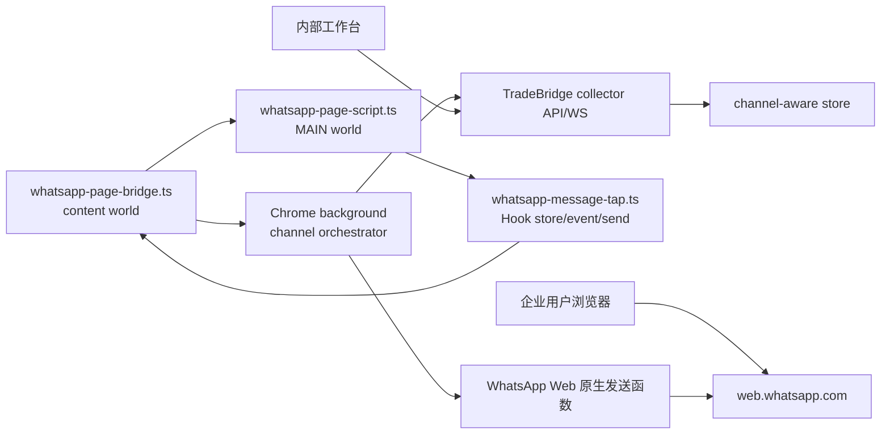

# WhatsApp Web SDK Hook Integration Plan

日期：2026-06-22
分支：`codex/whatsapp-integration-analysis`
状态：方案设计（架构评审后修订）
当前决策：先按 WhatsApp Web 页面运行时 Hook 接入，不走 WhatsApp Business Cloud API，不通过 token 获取消息。

说明：本文中的 “SDK Hook” 指页面 MAIN world 运行时 Hook / probe-based adapter，不表示 WhatsApp Web 提供公开、稳定、官方的浏览器 SDK。

## 1. 架构定位与结论

TradeBridge 可以把 WhatsApp Web 接入做成“Chrome 插件 + 页面 MAIN world 运行时 Hook + 多渠道同步协议”的内部试运行方案。

这条路线和现有 TM/OneTalk 接入方式接近：插件注入 page script，在页面自己的 JavaScript 运行时中被动包一层消息 store、事件总线、action dispatcher 或发送函数，拿到页面已经解密、已经进入业务模型的消息对象，再把脱敏后的标准消息交给 background 同步。

但这不是稳定官方 API 方案，也不应被对外描述成 WhatsApp 官方集成。WhatsApp Web 的 bundle、模块命名、内部 store 和 action 形态都可能变化，所以本方案必须按“先探测、再固化 adapter、持续诊断和降级”的方式推进。

Cloud API/BSP/Embedded Signup 仍然是未来合规生产路线。本阶段选择 WhatsApp Web 的前提是业务明确接受：绑定的是当前浏览器已登录账号，历史消息只能覆盖页面已加载数据，Hook 失效需要持续维护。

进入 MVP 前有两个硬前置：

- Phase 0 probe 必须证明存在可维护的运行时 Hook 面。
- Phase 1 多渠道 identity/outbound 隔离必须完成，否则 OneTalk 和 WhatsApp 会互相抢任务或混淆客户/会话。

## 2. 必须遵守的边界

- 不读取、不上传、不持久化 WhatsApp 登录凭据、认证 token、cookie、localStorage、IndexedDB 登录态、E2E key 或 service worker session 信息。
- 不用 token 去调用 WhatsApp 私有 HTTP 接口、私有 Graph 接口或 WebSocket 接口拉取消息。
- 不通过构造私有网络请求发送消息；发送只能调用页面运行时已经暴露或可定位到的原生发送函数。
- 所有 Hook 必须 pass-through：保留原函数返回值和异常行为，Hook 失败不能影响 WhatsApp Web 正常使用。
- 上传前只保留业务需要字段：会话 ID、联系人 ID、消息 ID、方向、文本、类型、时间、少量附件元信息和脱敏 raw。不得上传密钥、token、完整账号缓存。
- 默认只支持 1:1 文本消息；群组、媒体下载、联系人名片、语音、贴纸、reaction、引用回复等放后续阶段，并且需要单独隐私评审。
- 所有 probe、diagnostics、fixture 都必须脱敏，不记录真实手机号、真实消息正文、token-like 字段值、media direct path 或完整页面对象。

## 3. 当前代码基础

已经具备：

- `packages/collector-protocol/src/index.ts` 已预留 `whatsapp-web` channel id。
- `packages/database/migrations/005_channel_dimension.sql` 已给主要实体加 `channel` 和 `channel_account_id`。
- `apps/chrome-extension/src/channels/alibaba-im/onetalk-message-tap.ts` 已证明页面运行时 Hook 模式可行：包住 OneTalk 的 `emitter.emit`，被动捕获 `BaaSMessageNew` 和 `BaaSMessageSendCallback`。
- `apps/chrome-extension/src/channels/alibaba-im/onetalk-page-script.ts` 已有 MAIN world page script 模式：从页面 SDK 取 conversation/message service，调用原生发送函数。
- `apps/chrome-extension/src/channels/alibaba-im/onetalk-page-bridge.ts` 已有 content bridge 模式：注入 page script，用 `window.postMessage` 和 background 通信。
- `apps/chrome-extension/src/background/outbound-orchestrator.ts` 已有 outbound queue、pacer、投递回执逻辑。
- `packages/onetalk-adapter/src/sync-mapper.ts` 已有 channel sync batch 映射模式。

需要补齐：

- `apps/chrome-extension/src/background/index.ts`、`sync-orchestrator.ts`、`realtime-orchestrator.ts`、`outbound-orchestrator.ts` 仍然是 OneTalk 单通道抽象。
- `apps/chrome-extension/public/manifest.json` 只匹配 `https://onetalk.alibaba.com/*`。
- `apps/chrome-extension/vite.config.ts` 只把 OneTalk page script 包成 classic IIFE。
- `apps/server/src/server.ts` 的 collector outbound HTTP/WS claim 只按 seller 认领，没有 channel/channelAccount 过滤。
- `apps/server/src/server.ts` 的 `resolveConversationScope`、message list、AI/reply suggestion 上下文仍主要按 seller + external id 查找，没有完整 channel scope。
- `packages/database/src/postgres-sync-store.ts` 的 outbound create/list/claim/delivery 没有完整写入、返回、过滤 channel 字段。
- `packages/database/migrations/005_channel_dimension.sql` 目前唯一键主要是 seller + channel + external id，没有把 `channel_account_id` 纳入 customer/conversation/message 的唯一身份。
- `apps/web/src/internal-api.ts` 的 `scopeQuery` 只传 `sellerAccountExternalId`，Web 选中客户/会话时还没有把 channel scope 贯穿所有查询。
- `apps/web/src/dashboard-state.ts` 已在 conversation/customer 匹配中考虑 channel，但 selected customer key 仍是 external id，完整身份模型未闭环。

## 4. 目标架构



渠道建模：

- `channel=whatsapp-web`
- `surface=whatsapp-web`
- `channelAccount.externalAccountId`：优先使用 WhatsApp Web 页面运行时能稳定提供的登录手机号/JID；如果探测不到，必须让用户在插件配置中显式填写 WhatsApp 账号标识，并在 UI 上展示“账号标识来自人工配置”。
- `sellerAccount.externalAccountId`：仍然表示 TradeBridge 侧企业/卖家账号。
- customer/conversation/message/outbound 的逻辑身份必须是 `sellerAccountExternalId + channel + channelAccountExternalId + external*Id`，不能只用 seller + channel + external id。

## 5. Phase 0：Probe 与 Go/No-Go

WhatsApp Web 的 bundle/minified 模块名不稳定，所以不能直接假设某个长期固定的全局 SDK 名称。实施上要先做一个只在本地手动运行的 probe，不上传任何数据。

Probe 步骤：

1. 在已登录 WhatsApp Web 的 Chrome tab 中注入临时 MAIN world script。
2. 枚举安全的全局对象和模块候选，只输出对象 key/type，不输出值。
3. 观察发送/接收一条测试消息时哪些 store/event/action 被调用。
4. 确认消息对象里哪些字段可用于 id、chat id、fromMe、timestamp、body。
5. 确认账号身份是否可稳定读取；如果不可读取，验证人工配置账号标识能否和当前 tab 形成可解释的绑定。
6. 确认原生发送函数调用形态、返回值、异常行为和发送后 echo 事件。
7. 覆盖刷新页面、重新登录、弱网、WhatsApp Web 更新后找不到 runtime surface 的失败路径。
8. 把探测结果固化成 `whatsapp-runtime.ts` 的候选 resolver，并加 fake runtime 单元测试。

进入 MVP 的最低条件：

- 能稳定识别当前登录账号或有明确人工绑定策略。
- 能稳定获取 1:1 chat id、message id、direction、timestamp、text body。
- 能捕获实时 incoming text 和 outgoing echo。
- 能定位原生 text send 函数，并证明 wrapper 保留返回值和异常。
- Hook 失效时能报告稳定错误码，不影响 WhatsApp Web 原页面使用。
- diagnostics 只包含 key/type/count/error code，不含真实值和认证材料。

如果以上条件任一不满足，只能停留在 probe/内部研究阶段，不能进入 MVP。

## 6. WhatsApp Web Hook 设计

### 6.1 Hook 优先级

优先级从高到低：

1. 页面运行时的消息 store/collection 事件，例如 message add/update、chat add/update、ack/status update。
2. 页面运行时的 action dispatcher 或 event emitter，例如接收消息、发送成功、消息状态变化。
3. 页面运行时的原生发送函数，例如对当前 chat 调用 send text。
4. UI 自动输入和点击只作为兜底方案，必须放在 feature flag 后面；MVP 不默认启用。

禁止方案：

- 读取 WhatsApp 登录 token 后请求内部接口。
- 直接复用页面 WebSocket 连接或构造 WebSocket frame。
- 读取 IndexedDB/localStorage 中的认证材料。
- 通过抓包参数拼接私有消息接口。

### 6.2 Page Script

新增：

- `apps/chrome-extension/src/channels/whatsapp-web/whatsapp-page-script.ts`
- `apps/chrome-extension/src/channels/whatsapp-web/whatsapp-message-tap.ts`
- `apps/chrome-extension/src/channels/whatsapp-web/whatsapp-runtime.ts`

职责：

- 在 MAIN world 启动后轮询 WhatsApp Web 运行时对象，类似 OneTalk `installOneTalkMessageTap(window)`。
- 找到候选 store/event/action 后，只包函数，不改业务对象结构。
- 对每个 Hook 点做 diagnostics：runtime surface 名称、已观察 event/action、消息字段样本 key，不记录敏感值。
- 监听 content bridge 的 `send-whatsapp-web-message`、`get-whatsapp-web-conversations`、`get-whatsapp-web-history-messages`、`get-whatsapp-web-account`。
- 每个 wrapper 必须有 try/catch/finally 保护，异常路径向 bridge 发 diagnostics，但原函数异常仍按原样抛出。

### 6.3 Message Tap

页面消息对象标准化为：

- `externalConversationId`：chat id/JID/serialized chat id。
- `externalMessageId`：message id/serialized id。
- `externalCustomerId`：1:1 会话 remote JID 或手机号；群组先不作为 MVP。
- `direction`：`fromMe === true` 映射 `sent`，否则 `received`。
- `messageType`：`text`、`image`、`video`、`document`、`audio`、`sticker`、`system` 等。
- `content`：文本正文、caption 或页面模型中可安全读取的摘要。
- `sentAt`：WhatsApp Web timestamp 转 ISO。
- `attachments`：MVP 只保留文件名、mime、大小、thumbnail 可用性等元信息；不下载媒体内容。
- `rawSanitized`：只保留脱敏后的业务字段，明确剔除 token、secret、key、media direct path、完整缓存对象。

page script 向 content bridge 发送：

- `whatsapp-web-messages-observed`
- `whatsapp-web-capture-diagnostics`
- `whatsapp-web-account-observed`
- `whatsapp-web-runtime-unavailable`

这些消息再由 background 写入 WhatsApp 专用 buffer，并由 mapper 转成统一 `ChannelSyncBatch`。

### 6.4 Conversation / History

由于本阶段不允许通过 token/API 拉取，历史同步能力必须按页面运行时边界定义：

- MVP 同步 WhatsApp Web 当前运行时已经加载的 chat list 和每个 chat 已加载的最近消息。
- 不承诺全量历史回填。
- 不主动分页请求私有历史接口；如果页面运行时存在原生“加载更多历史”的业务函数，也必须经过探测确认它不需要 token 拼接和私有接口构造，且只在后续阶段评估。
- `historyBackfillEnabled` 对 WhatsApp Web 默认只能表示“读取已加载历史”，不能等同 OneTalk 的 SDK history fetch。

建议新增：

- `apps/chrome-extension/src/background/whatsapp-page-weblite-source.ts`
- `apps/chrome-extension/src/background/whatsapp-history-message-source.ts`
- `packages/whatsapp-web-adapter/src/sync-mapper.ts`

也可以先把 mapper 放在 extension 内部，等 WhatsApp 字段稳定后再抽成 package；但从测试和复用角度，更推荐直接建 `@wangwang/whatsapp-web-adapter`。

### 6.5 Sending

新增发送链路：

- Web 工作台创建 `channel=whatsapp-web` 的 outbound message。
- collector 只把 WhatsApp outbound 分配给声明支持 `whatsapp-web` 且 channelAccount 匹配的 Chrome extension。
- background 根据 `message.channel` 路由到 WhatsApp adapter。
- `whatsapp-page-bridge.ts` 找到 `https://web.whatsapp.com/*` tab，必要时注入 content bridge。
- page script 调用 WhatsApp Web 页面运行时的原生 text send 函数。
- 如果页面运行时无法同步返回 `externalMessageId`，不能直接把业务状态当作最终 sent；应先标记为 `submitted` 或 `sent_unconfirmed`，随后用 message tap 捕获到的 `fromMe` 回显消息按内容、会话和时间窗口完成去重/关联，再回写最终 `sent`。

发送必须继续使用 `OutboundPacer`，并新增 WhatsApp 专用错误码：

- `whatsapp_web_tab_required`
- `whatsapp_web_login_required`
- `whatsapp_web_account_mismatch`
- `whatsapp_web_runtime_unavailable`
- `whatsapp_web_send_function_unavailable`
- `whatsapp_web_send_timeout`
- `whatsapp_web_send_echo_not_found`
- `whatsapp_web_send_failed`

## 7. 多渠道核心前置改造

这是 WhatsApp Web 接入前必须做的第一步，否则会出现 OneTalk collector 抢 WhatsApp 消息，或 WhatsApp collector 抢 OneTalk 消息。

### 7.1 协议

更新 `packages/collector-protocol/src/index.ts`：

- `CollectorHelloMessage.payload.capabilities` 增加约定：例如 `channel:alibaba-im`、`channel:whatsapp-web`、`surface:onetalk-web`、`surface:whatsapp-web`。
- `CollectorHelloMessage.payload.channelAccounts` 或等价字段声明 collector 当前可处理的 `channel + channelAccountExternalId + surface`。
- `OutboundClaimMessage.payload` 增加可选 `channel`、`channelAccountExternalId`、`surface`；server 必须校验 claim 与 hello capabilities 匹配。
- `CollectorOutboundMessage` 增加 `channel`、`channelAccountExternalId`、`channelSurface`。
- `OutboundAvailableMessage.payload` 增加 `channel` 和可选 `channelAccountExternalId`，让 collector 可以判断是否需要 claim。
- `OutboundDeliveryReportMessage.payload` 增加可选 `channel`、`channelAccountExternalId`，用于审计和防串单校验。

### 7.2 Server / Database

更新 `apps/server/src/server.ts` 和 store interface：

- `/collector/v1/outbound-messages` 支持 `channel`、`channelAccountExternalId` query。
- WebSocket `outbound.claim` 按 collector capabilities、channelAccounts 和 claim payload 过滤。
- `realtimeHub.notifyOutboundAvailable` 带 channel/channelAccount，避免所有 collector 都来抢。
- `resolveConversationScope` 必须从 query 接收 channel/channelAccount，并按完整 scope 找 conversation/customer。
- `/internal/v1/conversations/:externalConversationId/messages` 不能只按 externalConversationId 查；必须带 seller/channel/channelAccount 或改为 conversation internal id。
- AI summary、reply suggestion、notes、tags、tasks、assignment 等工作台协作数据需要明确 scope：若跟随客户，应升级到完整 customer scope；若跨渠道共享，必须是产品显式决策。

更新 `packages/database/src/sync-store.ts` 和 `packages/database/src/postgres-sync-store.ts`：

- `CustomerScope`、`ConversationCustomerScope` 增加 `channel`、`channelAccountExternalId`。
- `CreateOutboundMessageInput` 按完整 conversation scope 找会话，并写入 conversation 的 channel/channelAccount。
- `listPendingOutboundMessages`、`claimPendingOutboundMessages`、`listOutboundMessages` 支持 channel/channelAccount 过滤。
- `markOutboundMessageDelivered` 校验 outbound id、seller、channel、channelAccount 或 claimed device，避免跨 channel 错报。
- `mapOutboundMessage` 返回 channel/channelAccount/surface。
- Postgres SQL join `channel_account`，返回 `channelAccountExternalId` 和 `channelSurface`。
- customer/conversation/message 的唯一约束建议升级到 `seller_account_id + channel + channel_account_id + external_*_id`。由于 `channel_account_id` 当前可空，需要先定义 legacy 数据回填和空值策略，避免 PostgreSQL nullable unique 带来的重复问题。

### 7.3 Web

更新：

- `apps/web/src/types.ts`：`CustomerScope` 增加 `channel`、`channelAccountExternalId`。
- `apps/web/src/dashboard-state.ts`：selected customer/conversation key 使用 seller + channel + channelAccount + external id，而不是只用 external id。
- `apps/web/src/internal-api.ts`：`scopeQuery` 带完整 channel scope。
- `listMessages`、`listOutboundMessages`、`createOutboundMessage`、AI/reply suggestion、notes/tags/tasks 全部使用完整 scope。
- UI 增加渠道 badge、channelAccount 标识和筛选，至少让人工发送前能看到当前会话属于 WhatsApp 还是 Alibaba IM。
- 回复框根据 channel runtime 状态禁用发送，并显示稳定错误码对应的用户可行动作，例如打开 WhatsApp Web、重新登录、切换账号。

### 7.4 Chrome Extension

把 OneTalk 单通道 orchestration 改成 channel registry：

```ts
interface BrowserChannelAdapter {
  channel: "alibaba-im" | "whatsapp-web";
  surface: string;
  getChannelAccount(): Promise<{ externalAccountId: string; displayName?: string } | null>;
  canHandleOutbound(message: OutboundMessage): boolean;
  pageSource(): SyncConversationSource;
  messageSource(): SyncMessageSource;
  historySource(): SyncHistoryMessageSource;
  send(message: OutboundMessage): Promise<PageSendResponse>;
}
```

第一阶段可以不做过度抽象，只要把 outbound 路由从 `sendOutboundMessagesViaOneTalk` 改成：

- `message.channel === "alibaba-im"` -> OneTalk
- `message.channel === "whatsapp-web"` -> WhatsApp Web
- unknown channel -> failed with `channel_not_supported_by_collector`
- channelAccount mismatch -> failed with `channel_account_mismatch`

HTTP pull 和 WS realtime 两条 outbound 链路都必须使用相同路由逻辑。

## 8. 新增文件建议

Chrome extension：

- `apps/chrome-extension/src/channels/whatsapp-web/whatsapp-page-bridge.ts`
- `apps/chrome-extension/src/channels/whatsapp-web/whatsapp-page-script.ts`
- `apps/chrome-extension/src/channels/whatsapp-web/whatsapp-message-tap.ts`
- `apps/chrome-extension/src/channels/whatsapp-web/whatsapp-runtime.ts`
- `apps/chrome-extension/src/channels/whatsapp-web/whatsapp-conversation.ts`
- `apps/chrome-extension/src/channels/whatsapp-web/whatsapp-history-message.ts`
- `apps/chrome-extension/src/background/whatsapp-tab-messaging.ts`
- `apps/chrome-extension/src/background/whatsapp-page-weblite-source.ts`
- `apps/chrome-extension/src/background/whatsapp-history-message-source.ts`

Adapter package：

- `packages/whatsapp-web-adapter/src/sync-mapper.ts`
- `packages/whatsapp-web-adapter/src/sanitizer.ts`
- `packages/whatsapp-web-adapter/test/sync-mapper.test.ts`

Build/config：

- `apps/chrome-extension/public/manifest.json` 增加 `https://web.whatsapp.com/*` host permission、content script 和 web accessible resource。
- `apps/chrome-extension/vite.config.ts` 增加 WhatsApp page script input，并把它也包装成 classic IIFE。

## 9. 分阶段实施

### Phase 0：WhatsApp Web probe

- 完成只本地运行、不上传数据的 runtime probe。
- 输出脱敏 diagnostics 样例和 go/no-go 结论。
- fake runtime 测试覆盖 message tap、account detection、send wrapper pass-through。

### Phase 1：多渠道 identity/outbound 硬隔离

- 协议、server、database、web、extension outbound 全部带 channel/channelAccount scope。
- message list、AI/reply suggestion、notes/tags/tasks 等内部查询完成完整 scope 改造或明确产品级共享策略。
- Postgres 唯一键和查询条件补齐 channelAccount 维度。
- OneTalk 现有测试必须通过。
- 增加同 seller、同 externalCustomerId/externalConversationId、不同 channel/channelAccount 的数据不串单测试。
- 增加 OneTalk collector 不能 claim WhatsApp outbound、WhatsApp collector 不能 claim OneTalk outbound 的测试。

### Phase 2：WhatsApp Web adapter 骨架

- 新增 manifest/vite/channel 目录。
- 完成 runtime resolver、diagnostics、login/tab/account detection。
- 完成 WhatsApp 专用 sanitizer 和 mapper。
- background channel registry 能同时注册 OneTalk 和 WhatsApp adapter。

### Phase 3：WhatsApp Web MVP

- 支持当前已登录 WhatsApp Web tab。
- 同步 chat list 中已加载的一对一会话。
- 捕获实时 incoming/outgoing text。
- 支持从 TradeBridge Web 工作台发送 text 到 WhatsApp Web。
- 发送结果通过 externalMessageId 或 sent echo reconciliation 回写。
- 未登录、账号不匹配、runtime 不可用、发送函数不可用时稳定失败，不误报成功。

### Phase 4：试运行增强

- 多 WhatsApp tab/account 选择策略。
- 更稳健的 runtime surface fallback。
- 媒体消息元信息同步。
- 群组只读或显式禁用策略。
- 兼容性 diagnostics 面板。
- 页面更新导致 Hook 失效时的告警和降级。
- 评估是否转向 WhatsApp Business Cloud API 作为生产主链路。

## 10. 验收标准

- WhatsApp Web 接入代码不读取、不上传、不持久化 token/cookie/key/localStorage/IndexedDB 登录态。
- Probe 通过 go/no-go 最低条件，且 diagnostics 不包含真实手机号、正文、认证材料或完整页面对象。
- OneTalk/alibaba-im 现有收发不回归。
- WhatsApp inbound text 能进入 `channel=whatsapp-web` 且 channelAccount 正确的 customer/conversation/message。
- WhatsApp outbound 只会被匹配 channel/channelAccount 的 WhatsApp Web adapter 认领，OneTalk outbound 只会被 OneTalk adapter 认领。
- 同 seller 下，不同 channel 或不同 channelAccount 的相同 external customer/conversation id 不互相污染。
- 消息列表、outbound 列表、AI/reply suggestion、notes/tags/tasks 不因相同 external id 跨渠道串数据；如产品选择共享，必须有显式说明和测试。
- WhatsApp Web 页面未打开、未登录、账号不匹配、runtime 不可用、发送函数不可用、echo 未捕获时都有稳定错误码。
- Hook wrapper 不改变 WhatsApp Web 原函数返回值和异常行为。
- 发送无法获得 externalMessageId 时不能直接误报最终成功，必须有 submitted/sent_unconfirmed 或等价状态，并在 echo 匹配后转最终 sent。

## 11. 主要风险

- WhatsApp Web 内部 bundle 会变，Hook 点需要持续维护。
- 非官方 Web 适配有平台规则风险，不适合对外宣传成官方 WhatsApp API。
- 历史消息完整性受页面已加载数据限制，无法承诺全量同步。
- 多账号、多 tab、企业员工个人 WhatsApp 登录态会带来权限边界问题，需要产品上明确“绑定的是当前浏览器已登录账号”。
- 当前数据库 channelAccount 维度还没有进入主要唯一键，若不先修正，多账号 WhatsApp 会有合并风险。
- outbound 状态如果只有 queued/sent/failed，容易在 echo 未确认时误报成功。
- 媒体消息下载涉及更复杂的页面运行时能力和隐私边界，MVP 不做。

## 12. 推荐下一步

先做 Phase 0 WhatsApp Web probe 和 Phase 1 多渠道 identity/outbound 硬隔离。只有 probe 证明运行时 Hook 面稳定，且 seller + channel + channelAccount + external id 的身份模型闭环后，才进入 WhatsApp Web MVP 实现。
