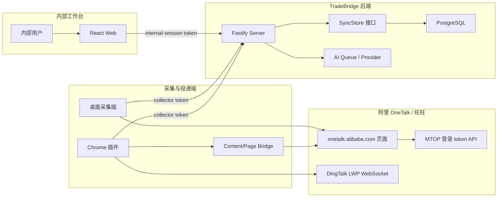
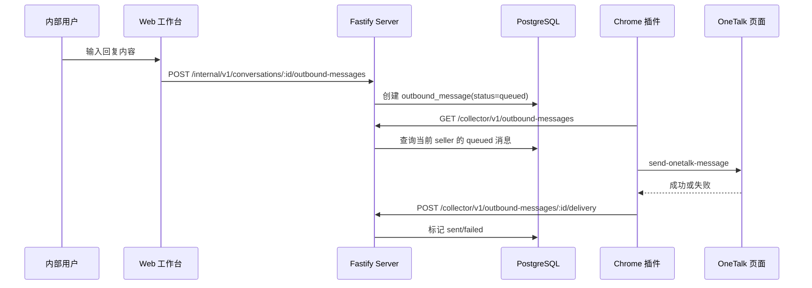

# TradeBridge 当前系统设计方案

日期：2026-06-01
状态：基于当前代码整理
范围：TradeBridge 本地内部试运行系统，包括 Web 工作台、服务端、数据库、Chrome 插件采集端、桌面采集端、OneTalk 适配层、外发消息和 AI 辅助能力。

## 1. 背景与目标

TradeBridge 是面向阿里国际站卖家沟通场景的内部销售工作台。系统通过采集端读取卖家在 OneTalk/旺旺中的客户、会话和消息，再同步到内部服务端和数据库，由内部销售团队在 Web 工作台中完成客户跟进、备注、标签、任务、消息回复和辅助分析。

当前系统采用本地优先、单租户试运行架构：

- 本地或局域网内运行 Fastify 服务端和 Vite Web 工作台。
- PostgreSQL 作为生产形态数据存储；测试和部分本地场景可使用内存实现。
- Chrome 插件是主要 OneTalk 采集与发送通道，依赖浏览器中已登录的 `https://onetalk.alibaba.com/` 页面。
- 桌面采集端是备用采集通道，依赖本机 AliWorkbench/AliSupplier 登录态。
- 采集端只持有 collector token；内部用户使用独立 internal session token。

## 2. 系统边界

### 已覆盖

- 内部用户初始化、登录、用户管理、邀请注册。
- 采集设备激活、token 注册、撤销和认证。
- OneTalk 客户、会话、历史消息同步。
- 同步批次幂等入库和敏感字段过滤。
- 内部客户列表、会话、消息查询。
- 客户备注、标签、跟进任务、客户分配。
- Web 侧创建外发消息，采集端投递到 OneTalk，服务端记录投递结果。
- 服务端侧客户总结和回复建议 API，默认使用确定性本地 provider，可接入 BullMQ 队列。

### 未覆盖或仍为试运行形态

- 多租户组织模型已经移除，当前以 seller account 作为主要业务隔离维度。
- Chrome 插件当前更依赖服务端幂等去重，尚未真正使用本地 `nextCursor` 做严格增量过滤。
- OneTalk 接口依赖页面运行时和 LWP 协议，属于对外部页面结构与 SDK 的适配，需持续兼容性验证。
- AI provider 当前默认是确定性 fallback，不是正式大模型集成。
- Web 工作台已经覆盖主要 CRM 操作，但尚未接入全部 AI API。

## 3. 总体架构



核心分层如下：

| 层 | 目录 | 职责 |
| --- | --- | --- |
| Web 工作台 | `apps/web` | 内部登录、客户工作台、客户协作、外发消息排队、用户管理 UI |
| 服务端 | `apps/server` | HTTP API、认证授权、collector 接入、内部业务 API、AI 任务入口 |
| 数据库包 | `packages/database` | 领域类型、内存实现、Postgres 实现、迁移和 SQL client |
| OneTalk 适配层 | `packages/onetalk-adapter` | LWP 协议、页面数据解析、消息/会话标准化、SyncBatch 映射 |
| Chrome 插件 | `apps/chrome-extension` | OneTalk 页面桥接、LWP 拉取、同步上传、外发消息投递 |
| 桌面采集端 | `apps/collector-desktop` | AliWorkbench 登录态探测、HTTP 采集、手动同步壳 |
| 环境包 | `packages/env` | `.env.local` / `.env` 加载 |

## 4. 认证与权限设计

系统有两类 token，不能混用：

1. Internal session token
   - 由 `/internal/v1/auth/login` 或邀请接受流程签发。
   - 用于 Web 工作台访问 `/internal/v1/*`。
   - 关联 `app_user`、`role`、`internal_session`。

2. Collector token
   - 由 `/collector/v1/auth/login` 或管理员接口 `/internal/v1/collector-devices` 签发。
   - 用于采集端访问 `/collector/v1/sync-batches` 和外发消息领取/回执接口。
   - 服务端只保存 `device_token_hash`，明文 token 只返回一次。

角色设计：

- `admin`：可初始化后管理用户、邀请、采集设备，并访问内部业务数据。
- `supervisor`：可访问内部业务数据。
- `sales`：可访问内部业务数据。

关键边界：

- 采集端 token 不能访问内部 API。
- 内部用户 token 不能替代 collector token 上传同步批次。
- 同步入库时，服务端会用 collector token 绑定的 seller/device 覆盖上传体中的 seller/device，防止采集端伪造归属。
- CORS 仅允许 localhost/127.0.0.1 和 Chrome 插件来源。

## 5. 数据模型

数据库迁移集中在 `packages/database/migrations`，核心表如下：

### 身份与权限

- `app_user`：内部用户账号。
- `role` / `user_role`：角色与用户关系。
- `internal_session`：内部登录 session，保存 token hash 和过期时间。
- `user_invitation`：用户邀请及接受状态。
- `audit_log`：登录失败、设备激活、客户分配、外发消息等操作审计。

### 采集与同步

- `seller_account`：卖家账号，业务隔离主键为 `external_account_id`。
- `collector_device`：采集设备，包含外部设备 ID、设备名、token hash、状态和心跳时间。
- `sync_batch`：采集批次，按 `(seller_account_id, source_batch_key)` 幂等记录。
- `customer`：客户档案，按 `(seller_account_id, external_customer_id)` 去重。
- `conversation`：会话，按 `(seller_account_id, external_conversation_id)` 去重。
- `message`：消息，优先按外部消息 ID 去重；无外部 ID 时按会话、时间、方向和内容哈希去重。

### 内部协作

- `customer_assignment`：客户分配。
- `customer_tag`：客户标签。
- `customer_note`：客户备注。
- `follow_up_task`：跟进任务。
- `ai_summary`：客户总结结果。
- `reply_suggestion`：回复建议。
- `outbound_message`：Web 侧排队、采集端投递、服务端回执的外发消息。

## 6. 入站消息同步设计

### 6.1 Chrome 插件主链路

Chrome 插件是当前主要采集端。安装后会创建两个 alarm：

- `tradebridge-sync`：每 30 分钟同步一次 OneTalk 数据。
- `tradebridge-outbound`：每 1 分钟领取并投递外发消息。

用户也可以通过插件弹窗发送 `sync-now` 手动触发同步。

同步流程：

1. 读取 `chrome.storage.local` 中的配置：`serverUrl`、`collectorToken`、`sellerAccountExternalId`、`deviceId`。
2. 查找已打开的 `https://onetalk.alibaba.com/*` tab。
3. 注入 content bridge，再注入 page script 到页面上下文。
4. page script 通过 OneTalk 页面运行时获取能力：
   - `lib.mtop.request` 获取 IM access token。
   - `IcbuIM.IMBaaSSDK` 获取会话列表和客户资料。
5. background 通过 LWP WebSocket 连接 `wss://wss-icbu.dingtalk.com/`。
6. 用 access token 发送 `/reg` 注册帧。
7. 调用 LWP 路由读取同步状态、会话和消息：
   - `/r/SyncStatus/getState`
   - `/r/Conversation/listNewestPagination`
   - `/r/SyncStatus/ackDiff`
   - `/r/MessageManager/listUserMessages`
8. 每个会话拉取消息，默认每页 50 条，当前默认每会话 1 页。
9. 使用 `mapWebliteToSyncBatch` 映射为统一 `SyncBatch`。
10. 上传前移除 cookie、token、csrf、chatToken 等敏感字段并做文本扫描。
11. 调用服务端 `POST /collector/v1/sync-batches`。
12. 保存同步状态、下一 cursor、diagnostics 和错误信息。

### 6.2 OneTalk 适配原则

OneTalk 数据结构存在多来源和多字段变体，适配层采用“稳定字段优先、加密字段兜底、原始结构保留但脱敏”的策略：

- 会话 ID 优先取 `cid`、`conversationCode`、`conversationId`、`id`，LWP 模型中取 `singleChatUserConversation.singleChatConversation.cid`。
- 客户 ID 优先从 LWP 双方 aliId 推导，再尝试 accountId、aliId、buyerAccountId 等稳定字段，最后兜底加密字段。
- 消息 ID 取 `messageId`、`msgId`、`messageID`、`msgIdStr`、`id`。
- 消息内容从 `content`、`text`、`messageContent`、`content.text.content`、`searchableContent.summary` 等路径提取。
- 消息方向优先使用显式 `direction`，否则根据 sender 和 self aliId 判断。
- `rawSanitized` 保留脱敏后的原始片段，便于排查适配问题。

### 6.3 服务端接入

`POST /collector/v1/sync-batches` 的处理逻辑：

1. 从 `Authorization: Bearer <collectorToken>` 解析 token。
2. 调用 `authenticateCollectorDevice` 校验 token hash 和设备状态。
3. 校验 batch 基础形状：seller、device、customer、conversation、message direction。
4. 用 collector device 绑定的 seller/device 改写 batch scope。
5. 调用 `store.acceptSyncBatch` 入库。
6. 返回 `{ ok, acceptedCount, rejectedCount, nextCursor, warnings }`。

Postgres 写入在事务中完成，任何异常都会 rollback。

### 6.4 幂等与 cursor

服务端幂等策略：

- `sync_batch` 使用 `(seller_account_id, source_batch_key)` 防止重复批次无限新增。
- `message` 使用外部消息 ID 去重。
- 无外部消息 ID 时使用 `(conversation_id, sent_at, direction, content_hash)` 去重。

Cursor 策略：

- 服务端返回本批次成功插入消息的最大 `sentAt` 作为 `nextCursor`。
- Desktop collector 会读取和保存本地 cursor。
- Chrome 插件当前保存 `nextCursor` 到状态，但映射时仍传入 `previousCursor: null`，因此实际增量主要依赖服务端去重，而不是客户端过滤。

## 7. Desktop Collector 设计

桌面采集端是备用路径，入口在 `apps/collector-desktop`。

设计特点：

- 从本机 AliWorkbench/AliSupplier 的 cookie DB、缓存文件和日志中探测登录态。
- 使用 HTTP 请求访问：
  - `https://onetalk.alibaba.com/message/weblitePWA.htm`
  - `https://onetalk.alibaba.com/message/getChatMessageList.htm`
- 使用本地 JSON 状态文件记录 cursor、失败批次和最近错误。
- 同步失败时将 batch 放入本地 failed queue，避免直接丢失。
- Electron shell 当前是 MVP，只提供状态展示和手动同步按钮。

桌面采集端和 Chrome 插件最终都上传同样的 `SyncBatch`，因此服务端和数据库层不需要区分来源，只通过 `sourceMeta.source` 记录来源。

## 8. 外发消息设计

外发消息采用“Web 排队、采集端投递、服务端回执”的闭环。



关键点：

- Web 创建外发消息时必须基于已存在的 seller/customer/conversation scope。
- Chrome 插件每分钟领取当前 collector token 绑定 seller 下的 queued 消息。
- 插件通过 page bridge 调用 OneTalk 页面内 `IcbuIM.IMBaaSSDK.default.getMessageService()`，优先使用 `sendUIMessages`，再兜底 `sendMessage` 或 `send`。
- 投递结果会写回 `status`、`externalMessageId`、`deliveredByDeviceId`、`deliveredAt`、错误码和错误信息。
- Web 展示时会隐藏已经被同步回来的 sent outbound message，避免同一条消息同时以“排队记录”和“真实同步消息”出现。

## 9. Web 工作台设计

Web 工作台位于 `apps/web`，采用 React + Vite。

核心页面状态：

- 登录态：本地存储 internal session、当前用户和 server base URL。
- 客户列表：从 `/internal/v1/customers` 读取。
- 会话列表：从 `/internal/v1/conversations` 读取后按客户过滤。
- 消息列表：从 `/internal/v1/conversations/:externalConversationId/messages` 读取。
- 客户协作：备注、标签、任务、分配、外发消息。
- 用户管理：仅 admin 用户可见。

工作台当前以“客户列表 + 会话 + 消息 + 侧边协作信息”的方式组织：

- 左侧：客户搜索与选择。
- 中间：客户摘要、会话条、消息流、回复输入。
- 右侧：备注、标签、任务、分配等协作数据。

前端 API client 只负责封装 HTTP 请求，不持久化业务数据；业务状态转换集中在 `dashboard-state.ts`，便于单元测试。

## 10. AI 辅助设计

服务端提供两类 AI 辅助 API：

- `POST /internal/v1/customers/:externalCustomerId/ai-summary`
- `POST /internal/v1/conversations/:externalConversationId/reply-suggestions`

设计上将 AI 分为两层：

1. `AiProvider`
   - 当前默认实现是 `createDeterministicAiProvider`，根据已有消息生成可预测结果。
   - 便于本地试运行和测试。

2. `AiJobQueue`
   - 默认 `createSyncAiJobQueue` 同步执行。
   - 配置 Redis 后可使用 BullMQ，把任务变成 queued 或等待完成。

AI 结果会写入 `ai_summary` 和 `reply_suggestion` 表。当前 Web 工作台还没有完整接入这些 AI API，因此它们属于服务端已具备、前端待集成的能力。

## 11. 安全与隐私设计

系统围绕“采集端最小权限”和“敏感字段不入库”设计：

- Collector token 和 internal session token 分离。
- Collector token 只保存 hash。
- 采集端上传前递归删除敏感字段，包括 cookie、authorization、ctoken、`_tb_token_`、cookie2、sgcookie、chatToken、accessToken、refreshToken 等。
- 上传前对 JSON 文本做敏感模式扫描，发现疑似 cookie/token 直接阻断。
- 服务端按 collector device scope 改写 seller/device，避免客户端伪造。
- 审计日志记录登录失败、设备激活、设备撤销、客户分配、外发消息排队等关键动作。
- `.env.local` 和本机 safe-storage 密钥只能用于本地，不应提交或写入共享材料。

## 12. 环境与运行

本地试运行的主要命令：

```bash
npm install
npm run dev
npm run build
npm run typecheck
npm run test:e2e
```

关键环境变量：

- `WANGWANG_SERVER_HOST`
- `WANGWANG_SERVER_PORT`
- `WANGWANG_SERVER_URL`
- `DATABASE_URL`
- `WANGWANG_COLLECTOR_TOKEN`
- `REDIS_URL` 或 `WANGWANG_REDIS_URL`
- `WANGWANG_AI_QUEUE_WAIT_FOR_COMPLETION`

如果未配置 `DATABASE_URL`，服务端会使用 `InMemorySyncStore`，适合测试但不持久化。

## 13. 测试与验证覆盖

当前测试覆盖按模块分布：

- `apps/chrome-extension/test`
  - LWP token、会话、消息拉取。
  - sync orchestrator 上传、错误记录、diagnostics。
  - sanitizer 敏感信息阻断。
  - outbound orchestrator 投递与回执。

- `packages/onetalk-adapter/test`
  - LWP 协议解析。
  - OneTalk 数据映射。
  - 客户资料字段兜底。
  - weblite 解析。

- `packages/database/test`
  - 内存 store 和 Postgres store 的同步、幂等、协作、审计、用户和设备逻辑。
  - migration runner 和 SQL client。

- `apps/server/test`
  - collector 同步 API。
  - internal auth、用户管理、设备管理。
  - 客户协作 API。
  - AI routes 和 AI queue。
  - CORS、bootstrap。

- `apps/web/test`
  - internal API client。
  - customer workflow 和用户管理 UI。

- `test/e2e/internal-trial.test.ts`
  - 端到端跑通服务端、采集端 fixture 上传、Web API 读取、协作操作和敏感信息不泄漏。

## 14. 已知风险与后续改进

1. Chrome 插件增量同步不完整
   - 当前保存了 `nextCursor`，但同步映射时传入 `previousCursor: null`。
   - 建议改为使用本地 `status.nextCursor` 或服务端返回的 per-conversation cursor，并补充回归测试。

2. 单会话单次拉取页数偏小
   - Chrome 插件默认每会话只拉 1 页 50 条。
   - 高活跃客户在 30 分钟内超过 50 条消息时可能漏掉较旧的新消息。
   - 建议引入可配置 `maxPagesPerConversation`，并按 LWP `hasMore/nextCursor` 继续分页。

3. OneTalk SDK/LWP 兼容性
   - 页面 runtime、SDK 方法名、LWP body 字段可能变化。
   - 建议保留 diagnostics，并建立真实账号 smoke runbook。

4. Desktop collector 与 Chrome 插件映射逻辑存在重复
   - Desktop collector 有自己的 mapper，Chrome 插件使用 adapter mapper。
   - 建议长期收敛到同一 mapper，减少字段兼容差异。

5. AI 能力尚未产品化
   - 服务端 API 已有，Web 尚未完整接入。
   - 建议先确定 AI provider 接口和安全策略，再接入 UI。

6. 数据访问范围仍比较粗
   - 当前内部角色都能访问业务数据，客户分配没有形成读取过滤。
   - 如果进入多人真实试运行，需要明确 supervisor/sales 的数据可见性规则。

7. 设备 token 运维体验
   - token 明文只返回一次是正确的，但丢失后只能重新激活或注册。
   - 建议 Web 用户管理中补充设备注册、撤销和状态说明。

## 15. 设计原则总结

TradeBridge 当前设计的核心取向是：

- 采集端靠近 OneTalk 登录态，服务端不保存阿里登录凭据。
- 服务端作为唯一业务边界，统一校验、脱敏后入库、幂等处理和权限隔离。
- Web 工作台只使用 internal API，不直接接触 OneTalk。
- 数据模型保留外部 ID 和原始脱敏片段，优先保证可追溯和可修复。
- 本地试运行优先可验证，Postgres/Redis/AI provider 都保留可替换边界。
